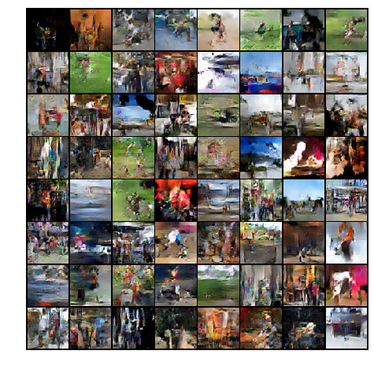

# Generating images from voice

## Installation

Make sure you have `virtualenv` and `python 3.5+` installed

```bash
bash install.sh
```
This will activate the virtualenv and install the proper packages.

To then launch the jupyter instance use
```bash
jupyter notebook
```
And you should be directed to `localhost:8888`. 

### Project structure
* [Models](models) - The resulting generated models
* [Utilities](utils) - Various tools such as visualization etc.
* [Scripts](scripts) - The scripts used for the project
* [Datasets](datasets) - The datasets used for the project

## Resources

### Voice to text
* Link here

### Text to image

* [Generative Adversarial Text to Image Synthesis](https://arxiv.org/pdf/1605.05396.pdf)

* [AttnGAN](https://arxiv.org/pdf/1711.10485.pdf)

* [Paragraph vectors](https://cs.stanford.edu/~quocle/paragraph_vector.pdf)

* [StackGAN++](https://arxiv.org/pdf/1710.10916)

* [CycleGAN](https://junyanz.github.io/CycleGAN/)

* Various papers with code [paperswithcode](https://paperswithcode.com/task/text-to-image-generation)

* Adversarial loss [short](https://www.quora.com/What-is-adversarial-loss-in-machine-learning) [paper](https://arxiv.org/pdf/1901.08753.pdf)

* Training GANs, [Tips and Tricks](https://github.com/soumith/ganhacks)

## Further information

### Report
The report Overleaf is available [here](https://www.overleaf.com/4488118745cjmprgwyfxcw)

### Notes

Might have to use a bag of words model or some other form of context presentation to simplify what the sentence says, look into this further.

### Training GANS

## Google Cloud Platform

### Jupyter notebooks
To use jupyter notebooks, run this on the remote
```bash
david@torcher-vm:~/StackGAN-Pytorch$ jupyter notebook --no-browser
```

Then tunnel your connection through
```bash
david@fridge:~$ ssh -N -L localhost:8888:localhost:8888 david@<EXTERNAL_IP_OF_VM>
```
Then simply open a browser on `localhost:8888` and provide it with the token that should be visible in the commandline window on the vm to connect.

### Show results
The images are viewable in python notebooks and can also, be downloaded from there. 

#### DCGAN
Result of the first DCGAN, trained over 200 epochs with the flickr2k_dataset. Based only on the latent vector, no scene information.



## TODO
* Implement the correct loss function
* Integrate the text embedding into the discriminator

